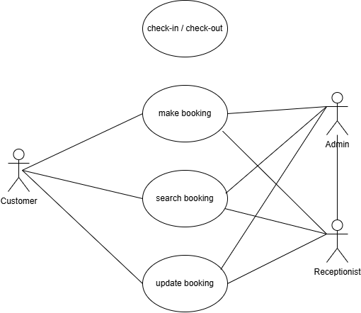

# requirement-analysis

# Requirement Analysis in Software Development

## Introduction
This repository provides a comprehensive overview of Requirement Analysis in the Software Development Life Cycle (SDLC). It is designed to help learners and professionals understand how to gather, analyze, and document software requirements efficiently.

## What is Requirement Analysis?

Requirement Analysis is the process of identifying the needs and conditions to meet for a new or altered product. It involves a set of tasks that help determine the needs of stakeholders and ensure a clear understanding of what the software must do.

This phase is essential in the Software Development Life Cycle (SDLC) as it lays the foundation for system design and development. A thorough requirement analysis helps prevent scope creep, minimizes risks, and ensures that the final product meets user expectations.

## Why is Requirement Analysis Important?

- **Prevents Miscommunication:** Ensures all stakeholders have a shared understanding of what the software should achieve.
- **Improves Project Planning:** Clear requirements help in accurate estimation of resources, time, and budget.
- **Enhances Product Quality:** Well-defined requirements lead to better design, coding, testing, and ultimately a better product.

## Key Activities in Requirement Analysis

- **Requirement Gathering:** Collecting requirements from stakeholders using interviews, surveys, and observation.
- **Requirement Elicitation:** Digging deeper into collected data to uncover true needs and expectations.
- **Requirement Documentation:** Clearly recording the requirements in formats like SRS (Software Requirement Specification).
- **Requirement Analysis and Modeling:** Analyzing requirements to identify gaps or conflicts and creating models like use case diagrams.
- **Requirement Validation:** Ensuring requirements are clear, consistent, and aligned with business goals.

## Types of Requirements

### Functional Requirements
These define what the system should do.

**Examples (Booking Management Project):**
- Users can search for available rooms.
- Admins can add or remove rooms from the system.
- Customers can make, cancel, or modify bookings.

### Non-functional Requirements
These define how the system performs.

**Examples:**
- The booking system should load within 3 seconds.
- System availability should be 99.9% during business hours.
- The system should support up to 10,000 concurrent users.

## Use Case Diagrams

Use Case Diagrams visually represent how users interact with a system and help identify functional requirements.

